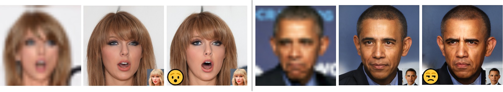
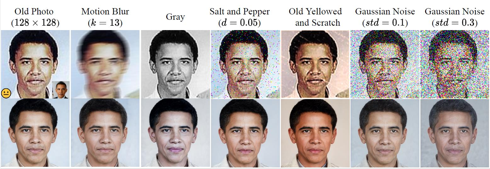

# SAIR

  

> For image restoration, most existing deep learning based methods resort to synthetic or real collected datasets. However, due to the high illness of the problem and the complex unknown degradation operator, these methods are usually vulnerable and cannot produce decent results. Recently, generative adversarial network (GAN) prior based methods reveal a powerful ability to restore photo-realistic and high-quality results. But they have a common and fatal problem that their generated results suffer from a semantic confusion, especially on semantically significant images such as face images. To address these problems, in this paper, we propose a semantic-aware latent space exploration method for image restoration (SAIR) to restore severely degraded images not only to high-resolution highly-realistic looks, but also to semantic consistency, an unsolved problem as of now. In SAIR, we explicitly model the semantic information of the low quality image such as the facial identity and the facial emotion.  Guided by the explicitly modeled semantics, SAIR optimizes an latent representation on a pre-trained high-quality image manifold, mapping the estimated optimal latent representation to a high-quality image. Unlike previous end-to-end training networks which require plenty of image pairs, SAIR only needs an unpaired high-quality image. Our extensive experiments demonstrate that SAIR can restore a high-quality result and preserve the original semantics simultaneously. In addition, as SAIR does not need paired training datasets, it is robust to handle various blind image restoration tasks. Our code can be found in the supplementary material. 

## Description

This is the code for the paper "Semantic-Aware Latent Space Exploration for Image Restoration" (SAIR)

To avoid the torturous environment configuration, we recommend you use [Anaconda](https://www.anaconda.com/products/individual#Downloads) to finish the next configuration. 

## Configuration

1. `conda create -n SAIR python=3.6`  
3. `source activate SAIR && conda install cudatoolkit=10.1`
4. `pip3 install -r requirement.txt -f https://download.pytorch.org/whl/torch_stable.html`
5. Download "stylegan2-ffhq-config-f.pt" by [Google Drvier](https://drive.google.com/uc?id=1EM87UquaoQmk17Q8d5kYIAHqu0dkYqdT) and "irestnet50.pth" by [Google Driver](https://drive.google.com/uc?id=10ygGBl9PBqff1VVasXHdxcKzBcAyS3Yq). Put these two model files in the directory "pretrained_models/"
6. Put the guide image and the corresponding inverse latent code in "guide_info/your_dir/". We solve for the inverse latent code by [e4e](https://github.com/omertov/encoder4editing) . In "guide_info", we provide two examples. 
7. All done. 

## Inference

`python run.py -i test_img/obama.png -gl guide_info/obama/latents.pt  -gi guide_info/obama/ref.png -e disgust -ee -eh`

